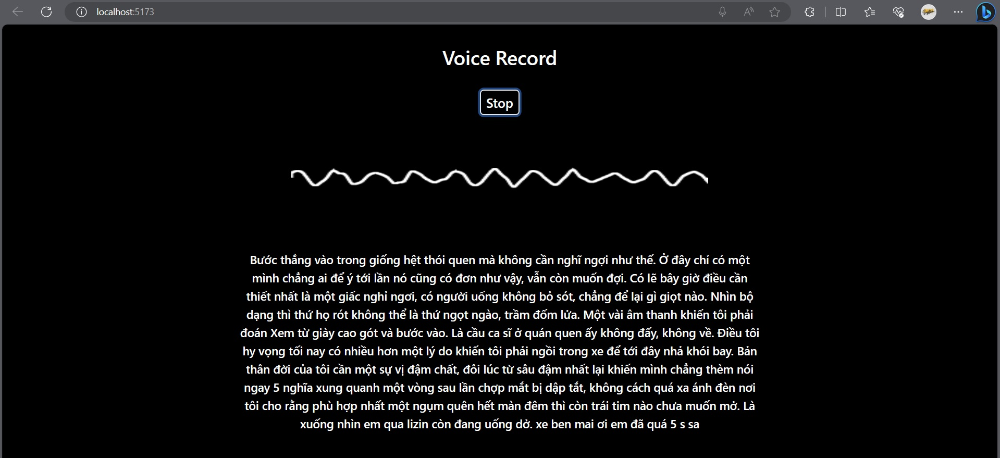

<h1 align="center">
   Visualizer wave with Web Speech APi
</h1>

## Quick Start

```bash
git clone --depth=1 git@github.com:datnguyennnx/Speech-Recognition.git
cd Speech-Recognition
pnpm install
```

Then, you can run locally in development mode with live reload:

```bash
pnpm dev
```

Open [http://localhost:3000](http://localhost:3000) with your favorite browser to see your project.


<p align="center"></p>

### Issue
If you are an AI engineer and are knowledgeable about Natural Language Processing and Digital Signal Processing, get in touch with me so that we can design an AI model that can recognize Vietnamese mixed with English. This project makes use of the Web Speech API, and I tested some songs with it using low-accuracy Vietnamese language detection techniques.