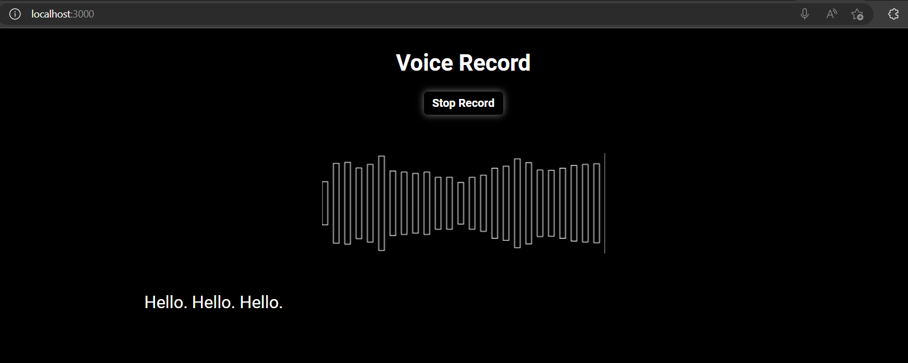
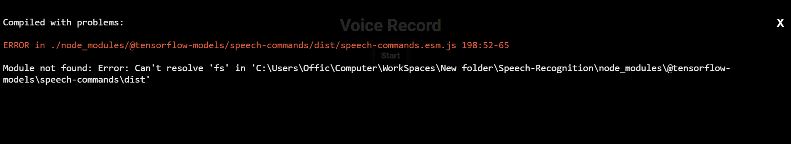
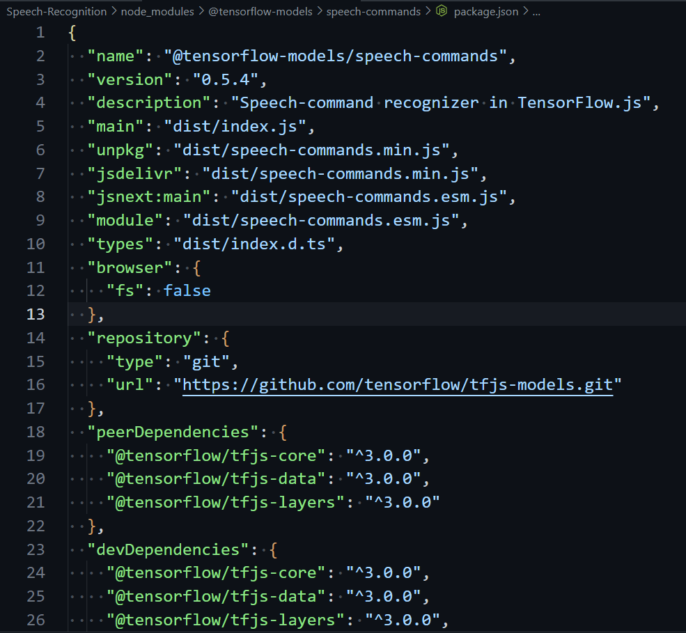

#### Required
  - Browser ( Recommend Edge, Chrome, ... ) 
  - Node.js ( version >= 18.xx )
  - Yarn ( latest version )

### Feature
  - [x] [Detect speech recognition using Web Speech API.](https://developer.mozilla.org/en-US/docs/Web/API/Web_Speech_API/Using_the_Web_Speech_API)
  - [x] [Embedded AI module training from Teachable Machine.](https://drive.google.com/file/d/1Yfe1k0btyc9kRWyZbzvMbc2yg4E9IVUt/view)
  - [ ] Code refactoring and recognition fixes should be done just once. 
### Installation
```
$ git clone https://github.com/datnguyennnx/Speech-Recognition
$ cd Speech-Recognition
$ yarn 
$ yarn start
```
<p align="center"></p>
Runs the app in the development mode.

Open [http://localhost:3000](http://localhost:3000) to view it in your browser.
The page will reload when you make changes.
You may also see any lint errors in the console.

### Troubling
If you see the error below. Solution for fixing this error, you find direct ``"Speech-Recognition\node_modules\@tensorflow-models\speech-commands/package.json"`` then add ```"browser": {
    "fs": false
  },``` then ```yarn start``` again.
<p align="center"></p>
<p align="center"></p>

